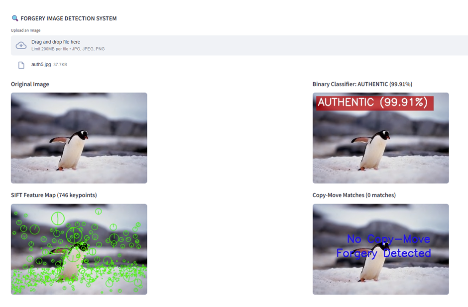
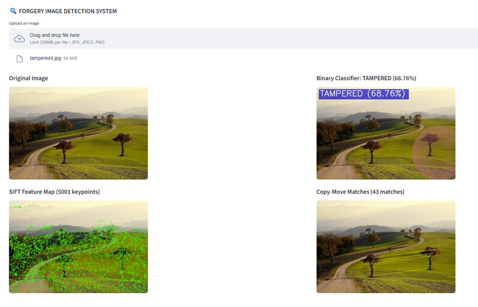

# Graph-Augmented Hybrid Framework for Deep-Learning-Based and Feature-Based Detection of Image Tampering and Copy-Move Forgeries

---
## Team Members

- Abraham Justin – 23MIA1027 
- Sudarshan Manikandan – 23MIA1078 
- Venkataraman – 23MIA1025 
---

## Base Paper Reference

**Title:** An Effective Image Copy-Move Forgery Detection Using Entropy Information 
**Authors:** Li Jiang, Zhaowei Lu 
**Publisher:** IEEE 
**Year:** 2024 


## Tools & Libraries Used

- Python 3.8+
- PyTorch
- OpenCV
- NumPy
- Matplotlib
- Streamlit
- scikit-image
- torchvision
- SIFT / ORB keypoint extractors
- EfficientNet-B0 (Machine Learning Model)
- Grad-CAM visualization
- glob, os, uuid

## How to Run the Project
### A) Streamlit Application

1. Open terminal
2. Navigate to project folder
```
cd project/src
```
3. Run Streamlit
```
streamlit run app.py
```
4. Upload an image

---
The system displays:

- Original Image
- Grad-CAM Heatmap
- SIFT Keypoint Visualization
- Copy-Move Detection Output
- Summary Panel
---

### B) Console Version

1. Navigate to:
```
cd src/
```

2. Run:
```
python main_integrated.py
```

3. Enter image path when prompted
4. Outputs are automatically saved in the results/ folder

## Dataset Description

The training dataset consists of tampered and authentic images sourced from publicly available datasets such as CASIA v2.0. 
It includes image manipulations such as: 

- Copy-move
- Splicing
- Object removal
- Region editing

Each image is labeled as tampered or authentic, supporting supervised binary classification. 
The dataset spans multiple categories (indoor, outdoor, objects, people), improving generalization across diverse manipulation types.

#### Output Screenshots
Authentic Image


Tampered Image


---
YouTube Demo
▶ Demo Link: https://youtu.be/H1L5Xe34UgU
---